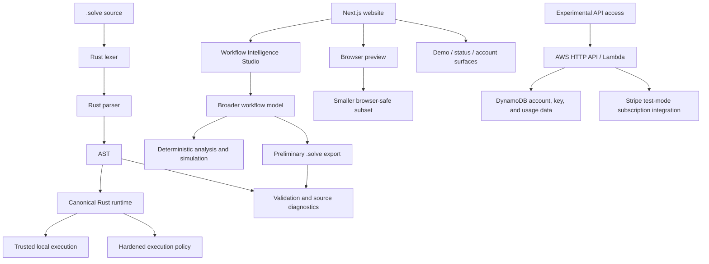
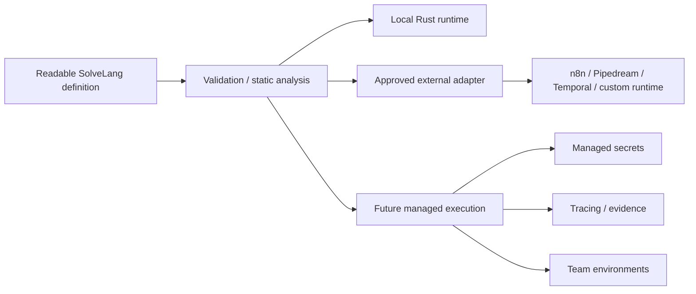

# SolveLang Architecture

This document describes the current repository architecture and distinguishes implemented layers from planned ones.

## Current architecture

## Layer 1 — Language implementation

**Working today.**

Primary code: `solvec-core/src/` for pure language modules and `solvec/src/` for native evaluation and host adapters.

Responsibilities include:
- lexing and parsing
- AST representation
- runtime evaluation
- imports
- diagnostics
- built-in helpers
- execution policy and preflight checks
- JSON input/output contract

The Rust CLI is the canonical source of executable SolveLang behavior.

## Layer 2 — Local execution and safety

**Working today, with some helpers experimental.**

Trusted local runs can use the current runtime capabilities. Hardened modes deny network, runtime file I/O, environment access, AI/agent use, and other mutation-style behavior according to the current policy.

Any new side-effecting built-in should be integrated into this policy before it is treated as safe.

## Layer 3 — Browser preview

**Preview.**

The browser `/run/` route implements a deliberately smaller subset for low-friction demos. It does not replace the Rust runtime.

Architectural consequence: subset compatibility must be managed explicitly to avoid semantic drift.

## Layer 4 — Workflow Intelligence Studio

**Working today as a local-first deterministic analysis surface.**

Studio uses a broader workflow model than executable SolveLang syntax. It can model concepts such as approvals, policies, exceptions, and evidence that are useful for analysis even when they do not yet map directly to runtime syntax.

Generated `.solve` output is preliminary and should be validated with the CLI.

## Layer 5 — Website and portfolio surfaces

**Working today as web/product presentation surfaces.**

The Next.js site includes documentation-oriented pages, browser preview, Studio, support-triage demo, public status, and experimental account/API interfaces.

A presentation page does not by itself prove a backend integration is live.

## Layer 6 — API/account/subscription infrastructure

**Experimental / test-mode.**

`services/api-access/` contains AWS SAM infrastructure and Node services for API access, customer accounts, keys, usage/metering, and Stripe-linked subscription behavior.

This layer should not be described as a production managed workflow runtime.

## Planned architecture direction

External adapters and managed execution are roadmap directions. They should be built only when repeated service/product demand justifies the operational burden.

## Architecture principles

- canonical runtime behavior has one authoritative implementation
- derived visual/preview surfaces must disclose compatibility boundaries
- deterministic logic and AI-driven behavior should remain distinguishable
- side effects must be explicit and policy-controlled
- human approval should be visible for consequential workflows
- repository truth is preferred over marketing abstraction
- external platforms should be reused when they already solve execution/durability/integration requirements better

## Key tradeoffs

### Separate browser preview

Benefit: instant static demo with no server runtime.

Cost: semantic drift risk.

### Broader Studio model

Benefit: richer business-process analysis than current language syntax.

Cost: export cannot imply one-to-one executability.

### Service-first business strategy

Benefit: revenue and product learning can begin before production SaaS operations exist.

Cost: delivery work is less scalable until repeated patterns are productized.

### Later managed execution

Benefit: avoids prematurely taking on secrets, incident response, durability, observability, and compliance burdens.

Cost: near-term customers may execute workflows on external platforms rather than SolveLang infrastructure.
